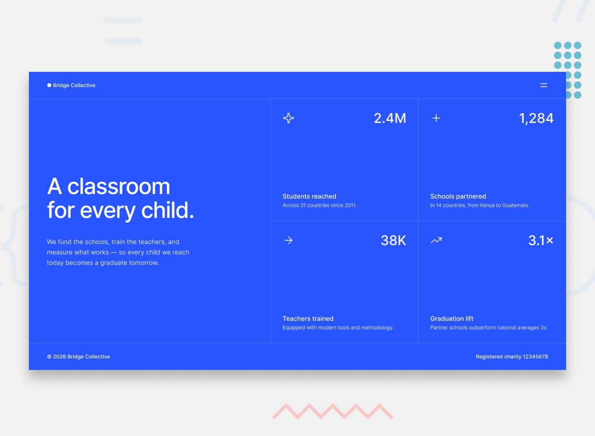

# Frontend Mentor - Grid landing page

Challenge from [Frontend Mentor](https://www.frontendmentor.io/).

## Built with
- HTML
- CSS
- JS

# Frontend Mentor - Grid landing page

# Overview

    This is my solution to the Grid landing page challenge from Frontend Mentor
    .

    The project is a responsive landing page for a fictional education nonprofit called Bridge Collective.

    The page features an impact statistics grid, a responsive navigation menu and a mobile layout adapted for smaller screens.

## Features
    Responsive desktop and mobile layouts
    CSS Grid for the main content layout
    Responsive navigation menu
    Animated menu and close icons
    Overlay when the navigation menu is open
    Mobile-specific menu behavior
    Hover states on interactive elements
    Custom Inter variable font
## Built with
    HTML5
    CSS3
    CSS Grid
    Flexbox
    JavaScript
    Responsive design

## Challenges

    One of the main challenges was creating the responsive navigation menu.

    The menu behaves differently depending on the screen size. On desktop, it opens from the side, while on mobile it covers the main hero section and uses an overlay over the rest of the page.

    I also had to use JavaScript to calculate the appropriate menu height on mobile.

## Author

    Crocq Corentin

    GitHub: Coco56-c
    Frontend Mentor: Coco56-c

Challenge provided by Frontend Mentor
